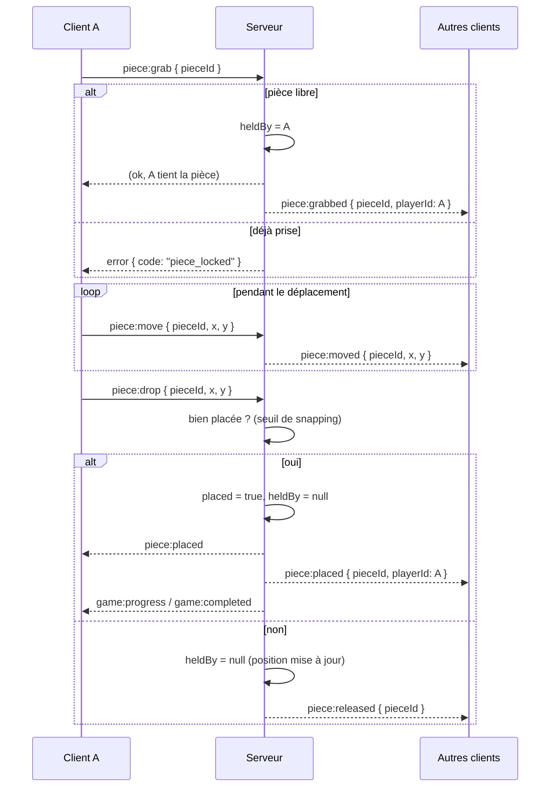

# Architecture technique

Conception technique du jeu. Voir [GAMEPLAY.md](./GAMEPLAY.md) pour les règles
et [CONCEPT.md](../CONCEPT.md) pour la vision.

## Vue d'ensemble

```
┌────────────┐   WebSocket temps réel   ┌─────────────────────┐
│  Client A  │◄────────────────────────►│                     │
├────────────┤                          │   Serveur temps     │
│  Client B  │◄────────────────────────►│   réel (Socket.IO)  │
├────────────┤                          │                     │
│  Client C  │◄────────────────────────►│   État en mémoire   │
└────────────┘                          │   par partie        │
      ▲                                  └─────────┬───────────┘
      │ HTTP (chargement app + images)             │
      └────────────────────────────────────────────┘
```

- Le **serveur est la source de vérité** : il détient l'état de chaque partie,
  valide les actions et diffuse les changements.
- Les **clients** affichent l'état et envoient des intentions (attraper,
  déplacer, relâcher). Ils n'ont pas autorité sur le placement.
- Pas de base de données pour le MVP : l'état vit **en mémoire**, indexé par
  code de partie.

## Stack proposée

| Couche        | Choix                          | Pourquoi                                    |
|---------------|--------------------------------|---------------------------------------------|
| Front         | React + TypeScript (Vite)      | Rapide à démarrer, typage partagé.          |
| Rendu plateau | Canvas via **Konva** (ou SVG)  | Bon pour glisser-déposer et beaucoup d'objets. |
| Temps réel    | **Socket.IO** (client+serveur) | Rooms, reconnexion, fallback intégrés.      |
| Serveur       | Node.js + Express              | Sert l'app, les images, et héberge Socket.IO. |
| État          | Objets en mémoire (Map)        | Suffisant pour le MVP ; Redis plus tard.    |
| Découpe image | Sharp (serveur) ou CSS/Canvas (client) | Sharp pour prédécouper, CSS pour zéro upload. |

> **Monorepo** simple avec deux packages : `client/` et `server/`, plus un
> `shared/` pour les types TypeScript communs (messages, modèle de données).

## Modèle de données

```ts
type Difficulty = "easy" | "medium" | "hard";
type GameStatus = "lobby" | "playing" | "completed";

interface Piece {
  id: string;
  row: number;        // ligne correcte dans la grille
  col: number;        // colonne correcte
  x: number;          // position courante (relative au plateau)
  y: number;
  placed: boolean;    // verrouillée à sa place ?
  heldBy: string | null; // playerId qui la tient, sinon null
}

interface Player {
  id: string;
  pseudo: string;
  color: string;      // couleur attribuée
  cursor: { x: number; y: number };
  connected: boolean;
  piecesPlaced: number;
}

interface Game {
  id: string;         // code de partie (ex. "K7QP")
  status: GameStatus;
  image: { url: string; width: number; height: number };
  difficulty: Difficulty;
  grid: { rows: number; cols: number };
  pieces: Piece[];
  players: Record<string, Player>;
  hostId: string;
  createdAt: number;
  completedAt?: number;
}
```

## Protocole temps réel

Communication par **événements Socket.IO**. Convention : le client envoie des
**intentions**, le serveur diffuse des **faits**.

### Client → Serveur

| Événement       | Charge utile                    | Effet                                   |
|-----------------|---------------------------------|-----------------------------------------|
| `game:create`   | `{ pseudo }`                    | Crée une partie, renvoie le code.       |
| `game:join`     | `{ gameId, pseudo }`            | Rejoint une partie existante.           |
| `game:configure`| `{ imageId, difficulty }`       | (hôte) Choisit image + niveau, découpe. |
| `cursor:move`   | `{ x, y }`                      | Position du curseur (throttlé).         |
| `piece:grab`    | `{ pieceId }`                   | Demande à attraper une pièce.           |
| `piece:move`    | `{ pieceId, x, y }`             | Déplace la pièce tenue.                 |
| `piece:drop`    | `{ pieceId, x, y }`            | Relâche la pièce à cette position.      |

### Serveur → Client

| Événement         | Charge utile                        | Signification                          |
|-------------------|-------------------------------------|----------------------------------------|
| `game:state`      | `Game` complet                      | État initial (à l'arrivée / reconnexion). |
| `player:joined`   | `Player`                            | Un joueur a rejoint.                    |
| `player:left`     | `{ playerId }`                      | Un joueur est parti.                    |
| `cursor:update`   | `{ playerId, x, y }`                | Curseur d'un autre joueur.              |
| `piece:grabbed`   | `{ pieceId, playerId }`             | Pièce prise par quelqu'un (verrou).     |
| `piece:moved`     | `{ pieceId, x, y }`                 | Pièce déplacée en direct.               |
| `piece:placed`    | `{ pieceId, playerId }`             | Pièce verrouillée (bien placée).        |
| `piece:released`  | `{ pieceId }`                       | Pièce relâchée sans être placée.        |
| `game:progress`   | `{ placed, total }`                 | Progression commune.                    |
| `game:completed`  | `{ completedAt, contributions }`    | Puzzle terminé.                         |
| `error`           | `{ code, message }`                 | Refus (ex. pièce déjà prise).           |

### Séquence : attraper → déplacer → poser



## Autorité serveur et concurrence

- Le **verrou `heldBy`** empêche deux joueurs de manipuler la même pièce : le
  premier `piece:grab` gagne, les suivants reçoivent `error`.
- Le **placement** (snapping) est décidé côté serveur → pas de divergence
  d'affichage entre clients.
- Le serveur **libère** les pièces d'un joueur qui se déconnecte.
- Les messages `cursor:move` et `piece:move` sont **throttlés** côté client et
  peuvent être « écrasés » (seule la dernière position compte).

## Découpe de l'image

Deux approches :

1. **Client (CSS / Canvas)** — chaque pièce est un `div`/nœud qui affiche une
   portion de l'image via `background-position` (ou un crop Canvas). Zéro
   traitement serveur, idéal pour le MVP.
2. **Serveur (Sharp)** — l'image est prédécoupée en N fichiers/tuiles envoyés
   aux clients. Utile si on veut des formes complexes (jigsaw) ou alléger le
   client.

La grille découle du niveau : `rows × cols` (voir table dans GAMEPLAY.md),
ajustée au ratio de l'image.

## Cycle de vie & nettoyage

- Une partie est créée en mémoire à `game:create`.
- Un **TTL** est appliqué : sans joueur connecté pendant X minutes, la partie
  est supprimée (timer de nettoyage périodique).
- À la complétion, l'état est conservé le temps d'afficher l'écran de fin.

## Sécurité & abus (léger)

- **Validation** de toutes les entrées côté serveur (id de pièce existe, joueur
  bien dans la partie, valeurs numériques bornées).
- **Limite de débit** par socket (anti-spam de messages).
- **Import d'image** : limiter taille/format, redimensionner, et si import
  d'URL, se méfier du SSRF (liste blanche ou upload direct).
- Codes de partie **non devinables** (aléatoire suffisant, ex. 4–6 caractères).

## Mise à l'échelle (plus tard)

- Passer l'état partagé dans **Redis** + adapter Socket.IO (`socket.io-redis`)
  pour plusieurs instances serveur.
- Servir images et assets via un **CDN**.
- Sharding des parties par code si le volume l'exige.

## Structure de projet proposée

```
puzzle-multiplayer/
├── CONCEPT.md
├── docs/
│   ├── GAMEPLAY.md
│   ├── ARCHITECTURE.md
│   └── ROADMAP.md
├── shared/            # types & constantes partagés (messages, modèle)
│   └── types.ts
├── server/
│   ├── src/
│   │   ├── index.ts       # Express + Socket.IO
│   │   ├── game.ts        # logique de partie (grab, drop, snap)
│   │   ├── store.ts       # état en mémoire + TTL
│   │   └── slicing.ts     # découpe / grille
│   └── package.json
└── client/
    ├── src/
    │   ├── main.tsx
    │   ├── net/socket.ts  # connexion Socket.IO
    │   ├── scenes/Board.tsx   # plateau + pièces
    │   ├── scenes/Lobby.tsx   # créer / rejoindre
    │   └── ui/Cursors.tsx     # curseurs des autres joueurs
    └── package.json
```
